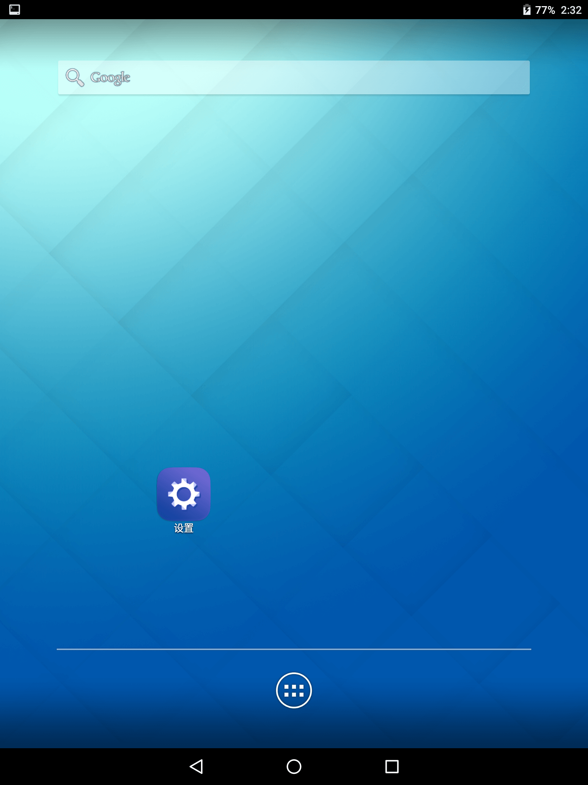
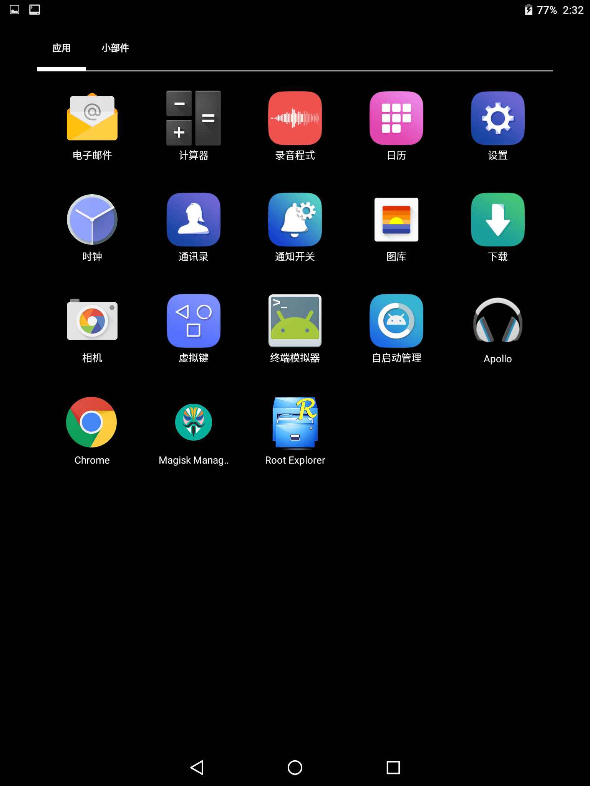
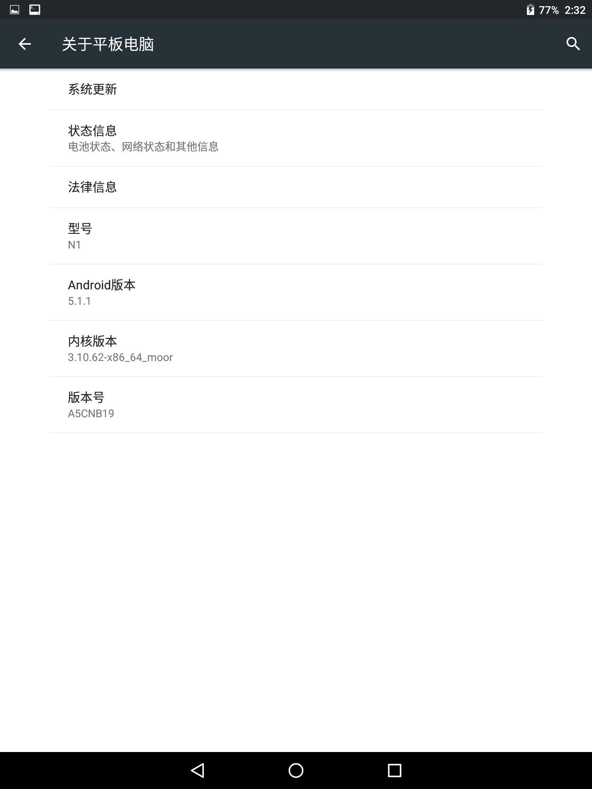

# Nokia N1 定制化 ROM

> Mod By Canwdev

ROM下载：[A5CNB19_update_CanwdevMod](./dist/A5CNB19_update_CanwdevMod_M3.zip)

## 改进

基于国行版 `A5CNB19` 进行定制修改的自用ROM，主要有以下改进：

- 内置 Magisk-v19.1，刷入后直接获取 ROOT 权限（刷入后首次开机会自动重启1次）
- 删除或重命名无用的 APP
    - 应用商店(已无法连接服务器)、客户服务
    - 重命名为.bak：浏览器、系统更新、Zlauncher
- 替换部分APP为台版的内置APP或 CyanogenMod App，功能更齐全
    - 加入：终端模拟器、RootExplorer、MagiskManager、CM壁纸、Trebuchet启动器
    - 替换：CM图库、Applo音乐播放器、Chrome浏览器、CM计算器、谷歌相机、时钟、原生Launcher2启动器
    - 美化：替换开机动画为CM11、替换字体为 Android6.0 系统字体

## 截图

## 刷入说明

需要已解锁，并刷入基于 `A5CNB19` 的 TWRP Recovery，可参考 [Nokia N1 ROOT 救砖教程](https://github.com/sukanka/NokiaN1Root)

推荐使用的Recovery：

- [twrp2.8.7.1-nokia-n1-zh.img](https://github.com/sukanka/NokiaN1Root/blob/master/twrp2.8.7.1-nokia-n1-zh.img)
- [twrp2.8.7.1-nokia-n1-mod-v4-A5CNB19(自改美化版)](./dist/twrp2.8.7.1-nokia-n1-mod-v4-A5CNB19.img)

## 参考教程

- [Nokia N1 ROOT 救砖教程](https://github.com/sukanka/NokiaN1Root)
- [如何查看Android设备上的分区信息](https://blog.csdn.net/Roland_Sun/article/details/50969958)
- [杂牌机搞机之旅（二）————移植TWRP第三方Recovery并刷入](https://www.cnblogs.com/kexing/p/10723732.html)
- [移植TWRP recovery](https://www.rabbittu.com/twrp-recovery-ba601/)
- [Android ROM包定制（解包，增删模块，打包）](https://luoyesiqiu.github.io/2019/04/30/Android-ROM%E5%8C%85%E5%AE%9A%E5%88%B6%EF%BC%88%E8%A7%A3%E5%8C%85%EF%BC%8C%E5%A2%9E%E5%88%A0%E6%A8%A1%E5%9D%97%EF%BC%8C%E6%89%93%E5%8C%85%EF%BC%89/)